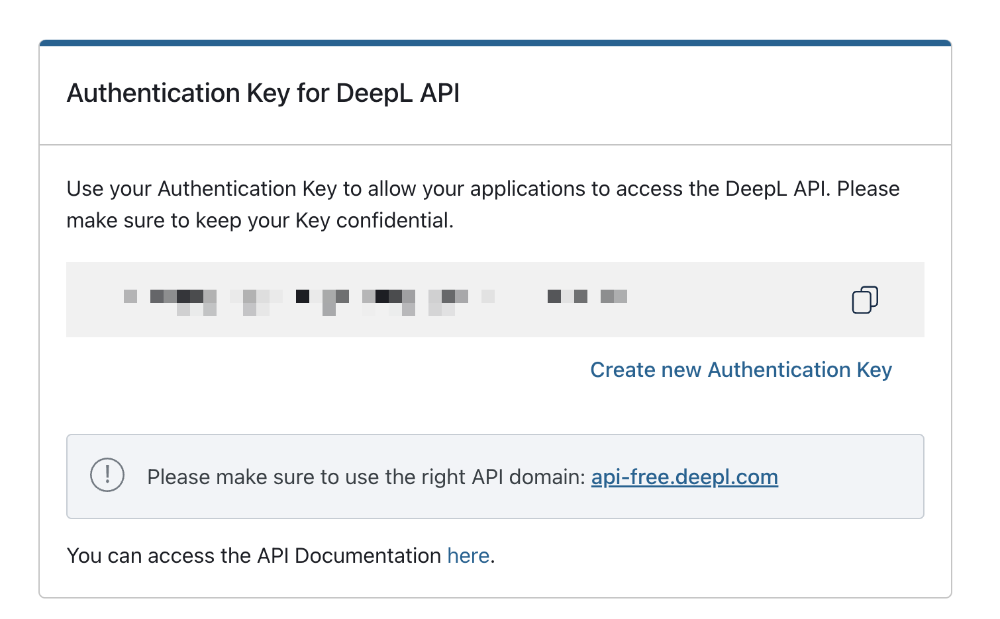
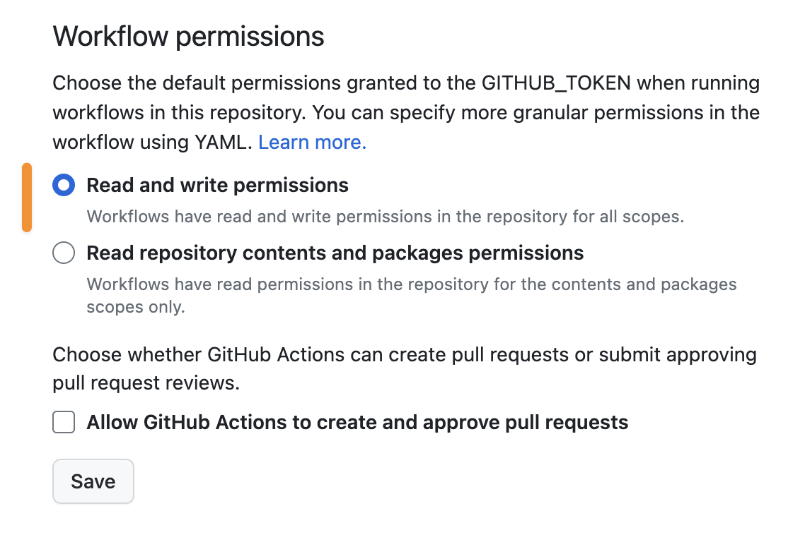

# DeepL Translate Github Action

This action uses the [DeepL Translate API](https://github.com/DeepLcom/deepl-node) to translate text files in your repository to your target languages. The output will follow the file extension of the given input file.

## Features

😎 Since DeepL API does not officially support markdown tag handling yet, it helps to mitigate some issues that DeepL may have when it comes to markdown documents.

✨ In v1.0.0, **HTML-like files** such as `.md | .html | .xml` are supported.
✨ From v2.0.0 onwards, **locale JSON** files are also supported.

## Inputs

| Name                  | Description                                      | Required |
| --------------------- | ------------------------------------------------ |:--------:|
| `deepl_api_key`       | API Key for DeepL API                            |   yes    |
| `target_languages`    | Target languages to translate to. Refer to [DeepL docs for language codes](https://www.deepl.com/docs-api/translate-text).                 |   yes    |
| `input_file_path`     | Path of the file you want to translate. Accepts `.html, .xml, .md, .json`           |   yes    |
| `output_file_name_prefix` | Prefix of the output file name, including folder name |   no     |
| `ignore_terms`        | Terms to ignore when translating                 |   no     |
| `no_translate_start_tag` | Start tag to ignore when translating in the case of HTML-like files such as `.html, .xml, .md`           |   no     |
| `no_translate_end_tag`   | End tag to ignore when translating in the case of HTML-like files such as `.html, .xml, .md`.                |   no     |

## Example usage & demo

### For `.md`, `.html`, `.xml` input

```yaml
name: Translate documents from docs/simple folder
on:
  workflow_dispatch:
  pull_request:
    types: [opened, synchronize]

jobs:
  build:
    runs-on: ubuntu-latest
    steps:
      - name: DeepL Translate Github Action
        uses: lyqht/deepl-translate-github-action@v1.0.0
        with:
          target_languages: zh,ja
          input_file_path: docs/simple/original.md
          output_file_name_prefix: docs/simple/
          deepl_api_key: ${{ secrets.DEEPL_API_KEY }}
```

With this workflow, you will get `docs/simple/zh.md` and `docs/simple/ja.md`

For a demo, refer to the [deepl-demo](https://github.com/lyqht/deepl-demo) repository.

### For locale json

```yaml
name: Translate locales json
on:
  workflow_dispatch:
  pull_request:
    types: [opened, synchronize]

jobs:
  build:
    runs-on: ubuntu-latest
    steps:
      - name: DeepL Translate Github Action
        uses: lyqht/deepl-translate-github-action@v2.0.0-alpha
        with:
          target_languages: fr,ja
          input_file_path: locales/en.json
          output_file_name_prefix: locales/
          deepl_api_key: ${{ secrets.DEEPL_API_KEY }}
```

With this workflow, you will get `locales/fr.json`, `locales/ja.json`.

For a demo, refer to [nuxt3-app-vue-i18n](https://github.com/lyqht/nuxt3-app-vue-i18n) repository, with a deployed app.


## FAQ

<details><summary>How to get DeepL API Token</summary>

First, you need to [sign up for a DeepL account](https://www.deepl.com/). Then you can go to https://www.deepl.com/account/summary and retrieve your token there.



</details>

<details><summary>If you don't have an existing GitHub Action workflow for your repository</summary>

1. Create a folder `.github/workflows` if you don't have it already
2. Inside that folder, create a YAML file say `translate.yml`
3. In the `translate.yml` file, you can copy the example below and modify it to your usage.
</details>

<details><summary>Why am I getting an error of "Permission to git denied to github-actions[bot]"</summary>

You have to set the workflow permissions under Repository Settings > Actions > Workflow permissions to be **"Read and write permissions"**.



</details>
